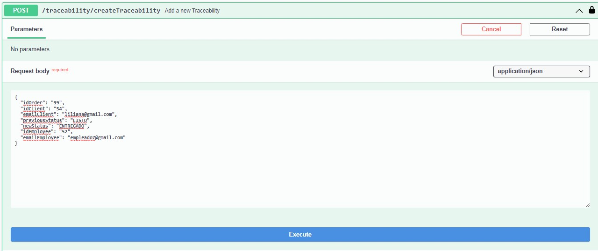

<br />
<div align="center">
<h3 align="center">PRAGMA POWER-UP</h3>
  <p align="center">
    This project develops an application that centralizes the services and orders of a restaurant chain that has different branches in the city..
  </p>
</div>

### Built With

* 
* 
* 
* 


### Unit tests are performed with
* [JUnit5](https://junit.org/junit5/) - Library used for testing
* [Mockito](https://site.mockito.org/) - Framework used for code testing
* [Jacoco](https://www.jacoco.org/jacoco/trunk/index.html) - Test coverage tool


<!-- GETTING STARTED -->
## Getting Started

To get a local copy up and running follow these steps.

### Prerequisites

* JDK 17 [https://jdk.java.net/java-se-ri/17](https://jdk.java.net/java-se-ri/17)
* Gradle [https://gradle.org/install/](https://gradle.org/install/)
* MongoDB [https://www.mongodb.com/](https://www.mongodb.com/)


### Installation

1. Clone the repository
2. Update the database connection settings
   ```yml
   # src/main/resources/application-dev.yml
   spring:
     data:
     mongodb:
       uri: mongodb://localhost:27017/traceability
       database: traceability
   ```
<!-- USAGE -->
## Usage

1. Right-click the class PowerUpApplication and choose Run
2. Open [http://localhost:8093/swagger-ui/index.html](http://localhost:8090/swagger-ui/index.html) in your web browser

<!-- ROADMAP -->
## Tests

- Right-click the test folder and choose Run tests with coverage


## Project structure

### Configuration Layer
It is the outermost layer and is in charge of security configuration, class assignment and dependency injection.

### Layer Adapters
This layer contains two layers: the driven layer and the driving layer.

#### Driving layer
It is the user's entry point when connecting to the application.

It is the most internal module of the architecture, it belongs to 
the domain layer and encapsulates the business logic and rules.


## Entry Points

### Entry point Create Traceability


### Exit point Create Traceability


## Author ✒️
* **Valentina Santa Muñoz** 

