<br />
<div align="center">
<h3 align="center">PRAGMA POWER-UP</h3>
  <p align="center">
    This project develops an application that centralizes the services and orders of a restaurant chain that has different branches in the city..
  </p>
</div>

### Built With

* 
* 
* 
* 


### Unit tests are performed with
* [JUnit5](https://junit.org/junit5/) - Library used for testing
* [Mockito](https://site.mockito.org/) - Framework used for code testing
* [Jacoco](https://www.jacoco.org/jacoco/trunk/index.html) - Test coverage tool


<!-- GETTING STARTED -->
## Getting Started

To get a local copy up and running follow these steps.

### Prerequisites

* JDK 17 [https://jdk.java.net/java-se-ri/17](https://jdk.java.net/java-se-ri/17)
* Gradle [https://gradle.org/install/](https://gradle.org/install/)
* MongoDB [https://www.mongodb.com/](https://www.mongodb.com/)


### Installation

1. Clone the repository
2. Create a new database in MySQL called square
3. Update the database connection settings
   ```yml
   # src/main/resources/application-dev.yml
   spring:
      datasource:
          url: jdbc:mysql://localhost/square
          username: root
          password: <your-password>
   ```
<!-- USAGE -->
## Usage

1. Right-click the class PowerUpApplication and choose Run
2. Open [http://localhost:8091/swagger-ui/index.html](http://localhost:8090/swagger-ui/index.html) in your web browser

<!-- ROADMAP -->
## Tests

- Right-click the test folder and choose Run tests with coverage


## Project structure

### Configuration Layer
It is the outermost layer and is in charge of security configuration, class assignment and dependency injection.

### Layer Adapters
This layer contains two layers: the driven layer and the driving layer.

#### Driving layer
It is the user's entry point when connecting to the application.

It is the most internal module of the architecture, it belongs to 
the domain layer and encapsulates the business logic and rules.


## Entry Points

### Entry point create restaurant
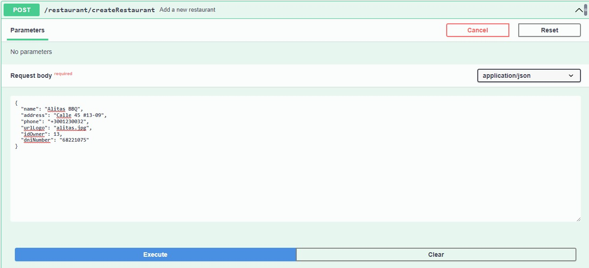

### Exit point create restaurant


### Entry point create dish Owner Authentication token
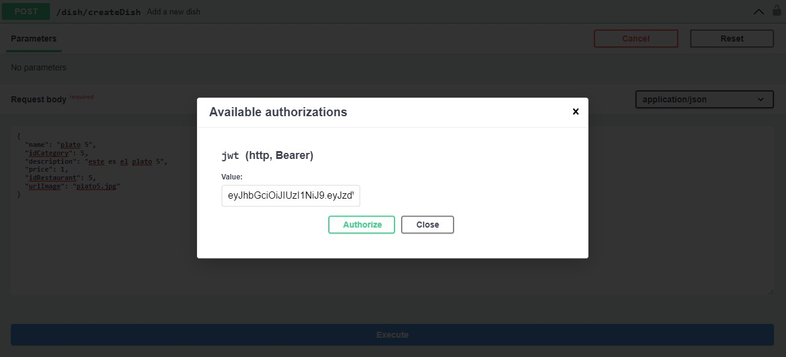

### Exit point create dish


### Entry point update dish Owner Authentication token
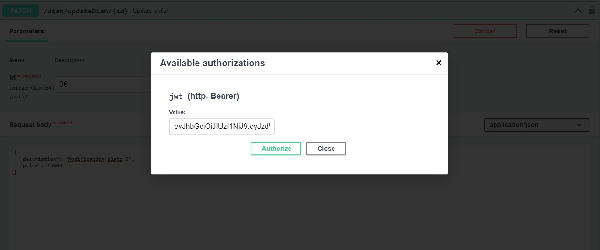

### Exit point update dish


### Entry point enable/disable dish
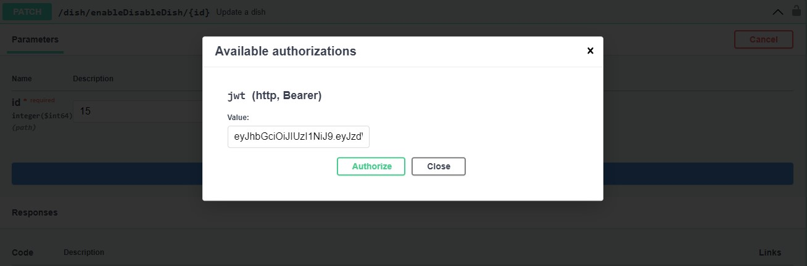

### Exit point enable/disable dish


### Entry point List Restaurants
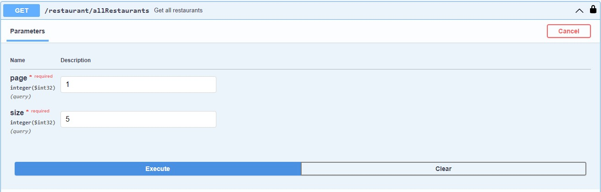

### Exit point List Restaurants


### Entry point Add Employee To Restaurant
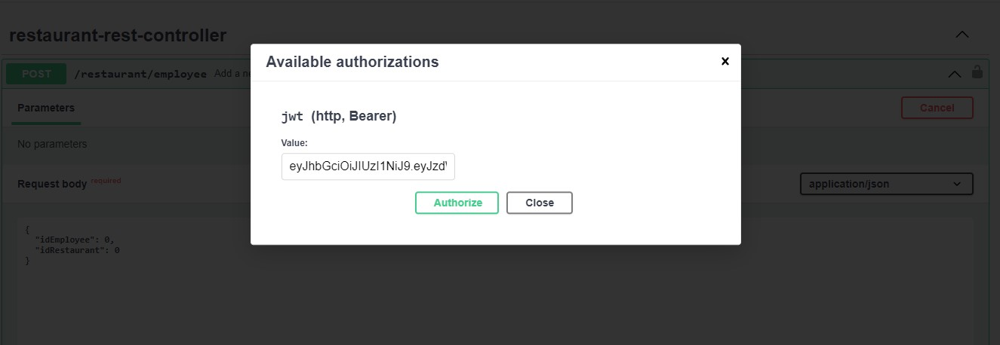

### Exit point Add Employee To Restaurant


### Entry point List Dishes
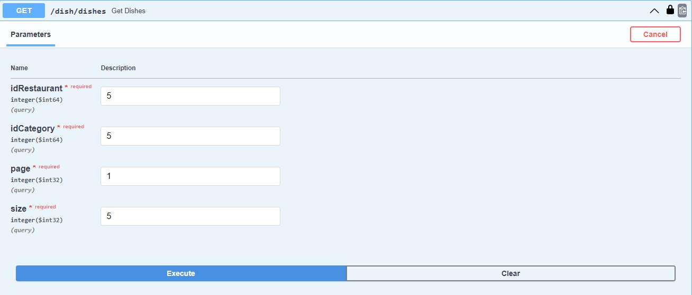

### Exit point List Dishes


### Entry point Create Order


### Exit point Create Order


### Entry point Create OrderDish
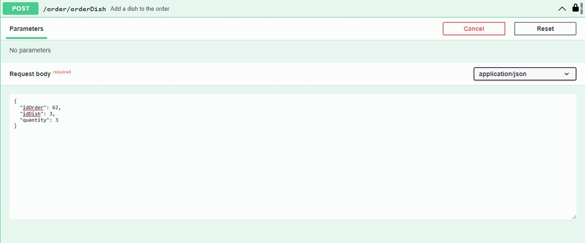

### Exit point Create OrderDish


### Entry point List Orders
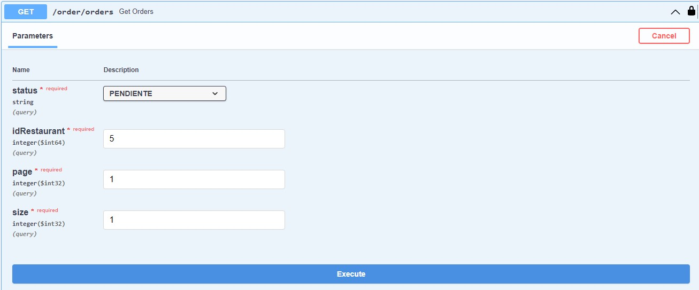

### Exit point List Orders


### Entry point Assign an Order
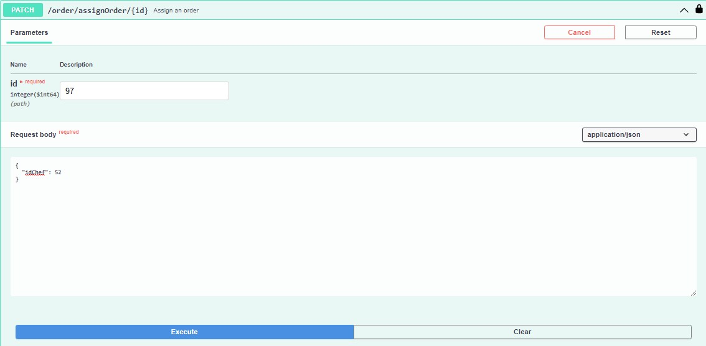

### Exit point Assign an Order


### Entry point Order Ready
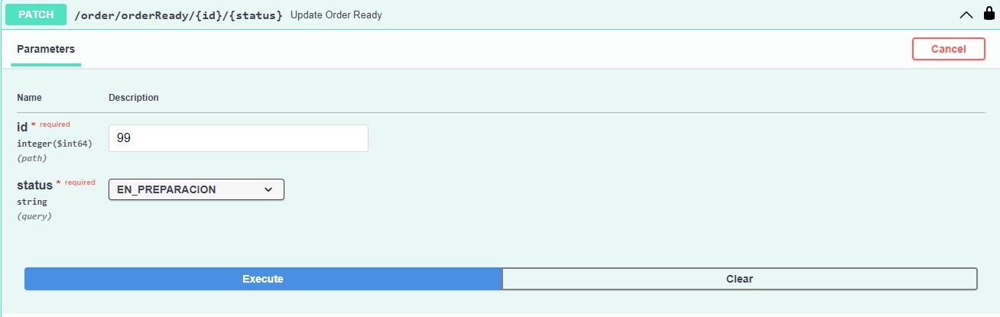

### Exit point Order Ready


### Entry point Order Delivered


### Exit point Order Delivered


### Entry point Order Canceled


### Exit point Order Delivered


## Author ✒️
* **Valentina Santa Muñoz** 

